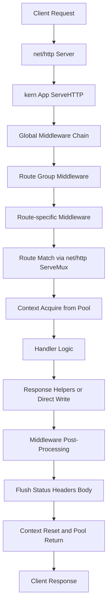

import { Callout } from "fumadocs-ui/components/callout";

# Architecture Flow

This page describes how a request moves through kern and how responses are produced.
It is useful for debugging middleware order, response shaping, and performance behavior.

If you are evaluating kern for API servers or production Go services, this flow explains where routing, middleware, request parsing, and response handling actually happen.

## High-level request/response path

<Callout type="tip">
    Middleware order follows registration order. The first middleware added is the outermost wrapper.
</Callout>

## Detailed execution stages

## 1) Listener and transport

- The Go `net/http` server accepts the request.
- The request is forwarded to kern's app handler.

## 2) Middleware wrapping

- Global middleware (`app.Use`) runs first.
- Group middleware runs next for matching groups.
- Route-level middleware (`RouteWithMiddleware`) runs closest to handler logic.

## 3) Route matching and context lifecycle

- Routing is handled using Go 1.22+ stdlib routing patterns.
- kern acquires a reusable context from pool-backed storage for low allocation overhead.

## 4) Handler execution

- Handler reads params, query, headers, and body via `Context` helpers.
- Handler writes response via `JSON`, `Text`, `NoContent`, `File`, or direct writer usage.

## 5) Response and unwind

- Middleware post-handler logic executes as the chain unwinds.
- Headers/status/body are finalized and sent to client.
- Context state is reset and returned to pool.

## Middleware placement guide

- Global middleware: logging, recovery, request id, CORS, security defaults.
- Group middleware: authn/authz for API or admin surfaces.
- Route middleware: strict guards and size limits for sensitive endpoints.

## Operational notes

- For strict request validation, use `RequestGuard` and strict parsing config.
- For response bounding on selected routes, use `ResponseLimit` and handle `ErrResponseTooLarge` in stream writes.
- For observability, record deny/error paths near the relevant middleware layer.

## Why this matters

- It helps you place middleware at the right layer.
- It makes performance tuning easier by showing where allocations and work happen.
- It improves debugging for malformed requests, middleware short-circuits, and response handling edge cases.

## FAQ

### Does kern use a custom router?

No. kern relies on Go 1.22+ `net/http` routing behavior and builds framework ergonomics around it.

### Where should I put request validation?

Put broad policies in middleware and route-specific validation close to the route using `RouteWithMiddleware`, `RequestGuard`, and handler-level checks.
